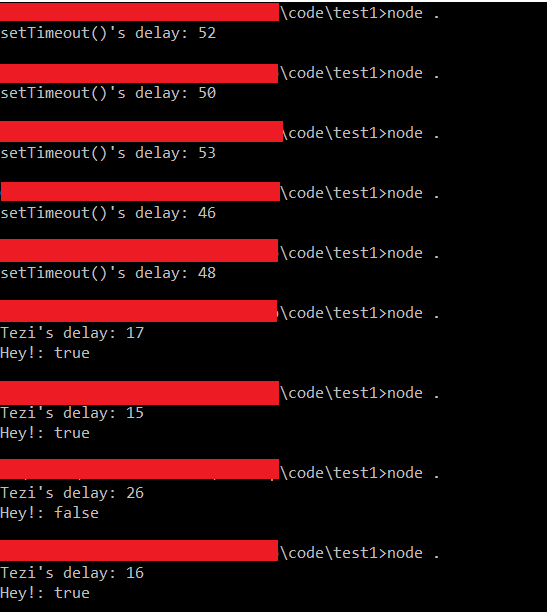

# Tezi (Not Good)
A function that bypasses the event loop to provide an accurate Timeout feature.

## Why not the usual setTimeout()
The JS's own setTimeout() function is designed so that it runs only after an I/O operation has been completed irrespective of its synchrosity or the lack of it. Tezi circumvents that problem and also provides with a more accurate timer or less delay. 
** The setTimeout() rarely delivers a delay of 0 ms, whereas Tezi does it in some of the cases. **

## Installing and Using
Use `npm install tezi` to install the package. Inside the package, the function you use is `newTimeout(interval, cb)`. `interval` stands for the amount of time to be waited after which `cb(err, data)` is called.
`err` contains the error if it exists, `data` is a json object with a property `success` which is true when there is a delay of 0ms and false otherwise.
### Example
```
const tezi = require('tezi');
tezi.newTimeout(500, (err, data) => {
	if(err) throw err;
	console.log(`Hey!: ${data.success}`);
});
``` 


